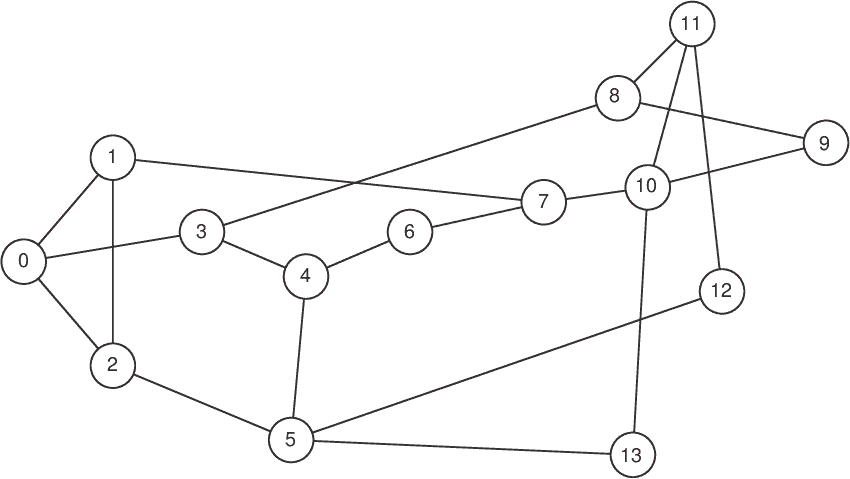
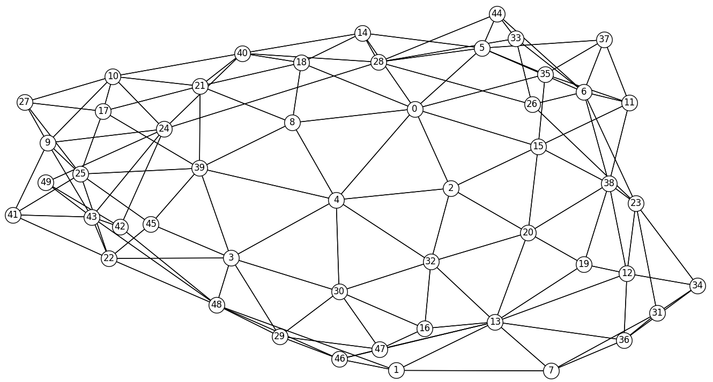
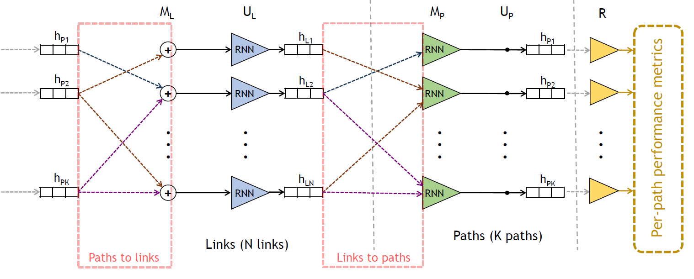
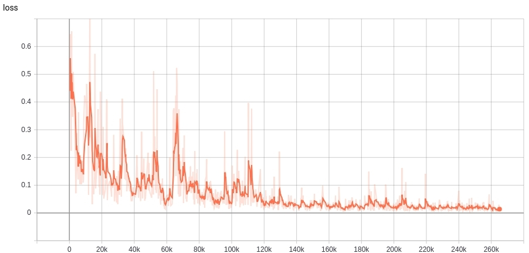
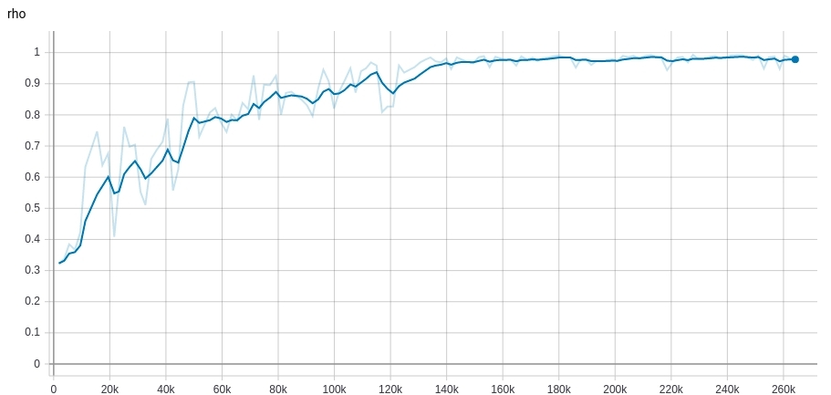

# Understanding RouteNet - Review and Implementation of RouteNet Evaluation and Use Cases

## Abstract

This project is an implementation centric approach to understanding and illustrating 
[RouteNet](https://arxiv.org/abs/1901.08113)). This project has the following aims:

 - Repackage the original 
 [RouteNet demo code](https://github.com/knowledgedefinednetworking/demo-routenet/tree/master/code) 
 as a Python pckage, suitable for use in production environments, with documented code, unit tests, 
 smoke tests, automated builds and other features expected of production ready code.
 - Implement, and seek to replicate, the original findings for delay and jitter in section 
 4 "EVALUATION OF THE ACCURACY OF THE GNN MODEL" from the 
 [RouteNet paper](https://arxiv.org/abs/1901.08113)
 - Implement the use cases discussed in section 5 of the paper. 
 [RouteNet paper](https://arxiv.org/abs/1901.08113)  
 - Given the above as a baseline against which to test and compare, implement a data pipeline 
 suitable for ingesting data from sources other than the original OMNet++ network simulator. 

## What is RouteNet?

From the seminal paper 
[Unveiling the potential of Graph Neural Networks for network modeling and optimization in SDN](https://arxiv.org/abs/1901.08113):

*... RouteNet, a pioneering network model based on Graph Neural Networks (GNN), ... able to 
understand the complex relationship between topology, routing and input traffic to produce accurate 
estimates of the per-source/destination pair mean delay and jitter, ... to generalize over 
arbitrary topologies, routing schemes and variable traffic intensity.*

## Authors

This project is part of the joint 
[MSc. in AI and Deep Learning](https://master-artificialintelligence.com) 
dissertation project for [Nathan Sowatskey](https://www.linkedin.com/in/nathansowatskey/) 
and [Ana Matute](https://www.linkedin.com/in/ana-matute-06330118a/).

## Origins

This project started as a GitHub fork of the demo paper 
[Challenging the generalization capabilities of Graph Neural Networks for network modeling](https://github.com/knowledgedefinednetworking/demo-routenet) 
by J. Suárez-Varela, S. Carol-Bosch, K. Rusek, P. Almasan, M. Arias, P. Barlet-Ros and 
A. Cabellos-Aparicio.

## Quickstart

The original authors of the 
[demo paper](https://github.com/knowledgedefinednetworking/demo-routenet) provide a trained 
RouteNet model, in the form of Tensor Flow (TF) checkpoints, which may be found in the 
['trained_models' directory](trained_models)).

The pre-trained model is based on 480K training samples, including 240K samples from the 
[14-node NSF network topology](http://knowledgedefinednetworking.org/data/datasets_v0/nsfnet.tar.gz) 



and 240K samples from the 
[50-node synthetically-generated topology](http://knowledgedefinednetworking.org/data/datasets_v0/synth50.tar.gz).



The pre-trained model can be loaded to make per-source/destination delay predictions on any sample 
from the datasets, as demonstrated in the 
[prediction demo Jupyter notebook](./demo_notebooks/prediction_demo.ipynb).

# Project Structure and Admin

This project has a [Travis Build](https://travis-ci.com/Data-Science-Projects/demo-routenet).

## The RouteNet Python Package

The RouteNet Python package is in the [src/routenet](src/routenet) directory.

## Unit and Smoke Tests

[Unit](tests/unit) and [Smoke tests](tests/smoke_tests) are in the [tests](tests) directory. 

# RouteNet in Code

The following figure shows a schematic representation of the internal architecture of RouteNet. In 
this implementation, the input per-source/destination traffic is provided in the initial path 
states, while the link capacity is added as an input feature in the initial link states.



This model is implemented in [routnet_model.py](src/routenet/model/routenet_model.py).

# OMnet++ Data Pipeline

The original sample data sets produced by the [OMNet++](https://omnetpp.org) are described in 
detail in [OMNet++ data files and formats]. How OMNet++ was used to produce these data sets is 
outlined in section 4.1, "Simulation setup", of the [paper](https://arxiv.org/abs/1901.08113), but
there is no public means to replicate that part of the experiment.


All the datasets used in the demo are available in the following 
[repository](https://github.com/knowledgedefinednetworking/NetworkModelingDatasets/tree/master/datasets_v0). This repository includes a detailed description on how to process the datasets.

## Running RouteNet

In order to facilitate the execution of RouteNet, we provide some example functions in the 
script **[run_routenet.sh](./bin/run_routenet.sh)**. This script contains different calls to the 
RouteNet code (**[routenet_with_link_cap.py](src/routenet/train/train.py)**). Also, they 
provide some predefined hyperparameters that can be easily modified in the script.

## 'How to' guide
First of all, you can prepare the Python environment for the demo executing the following command:

```
pip install -r requirements.txt
```

This command installs all the dependencies needed to execute RouteNet.

To train and evaluate RouteNet it is necessary to download some datasets from the 
[dataset repository](https://github.com/knowledgedefinednetworking/NetworkModelingDatasets/tree/master/datasets_v0). In this repository you can find three datasets with samples simulated with a custom packet-level simulator in three different topologies: NSFNET (2GB), GEANT2 (6GB)
and synthetic 50 nodes (28.7GB) topologies. To download and decompress the three datasets you 
can use the following commands:

```
wget "http://knowledgedefinednetworking.org/data/datasets_v0/nsfnet.tar.gz"
wget "http://knowledgedefinednetworking.org/data/datasets_v0/geant2.tar.gz"
wget "http://knowledgedefinednetworking.org/data/datasets_v0/synth50.tar.gz"
tar -xvzf nsfnet.tar.gz 
tar -xvzf geant2.tar.gz 
tar -xvzf synth50.tar.gz
```

Note that it is not necessary to download the three datasets to start to play with RouteNet. 
For instance, you can start using only the NSFNET dataset. 

Then, you may use the script [routenet_with_link_cap.py](src/routenet/train/train.py) 
to train a RouteNet model that predicts the per-source/destination delay. First of all, it is 
necessary to modify the variable 'path_to_datasets' to point to the path where the datasets were 
stored. This script assumes that all the datasets are stored in a same directory.

In order to train RouteNet it is necessary to convert the datasets to the 'TFRecords' format of 
TensorFlow. Our datasets provide directly the TFRecords files that we used to train and evaluate 
RouteNet (in the subdirectories 'tfrecords/train' and 'tfrecords/evaluate').
However, you can also run the following commands to generate the TFRecords files correspondingly 
for the three different datasets:

```
./run_routenet.sh tfrecords nsfnetbw
./run_routenet.sh tfrecords geant2bw
./run_routenet.sh tfrecords synth50bw
```

Now, everything is ready to train a RouteNet model. For instance, you can use the following command 
to train a model using samples just from one topology:

```
./run_routenet.sh train nsfnetbw 50000
```

In this case, RouteNet is trained over the training datasets of NSFNET and evaluated over the 
evaluation samples of the same topology. Note that 'nsfnetbw' can be replaced in this command by 
'geant2bw' or 'synth50bw' to train the model with the training and evaluation samples of the two 
other topologies.

This implementation of RouteNet has support to be trained with samples from topologies of variable 
size. For instance, you can execute the command below to train a model with samples from the NSFNET 
and the 50-node topology:

```
./run_routenet.sh train_multiple nsfnetbw synth50bw output_logdir 100000
```

By default, the evaluation is done on the entire GEANT2 dataset (train and evaluation TFRecords). 
However, it can be easily modified by setting the paths provided in the '--eval_' flag of the 
'train_multiple' function in the script [run_routenet.sh](./bin/run_routenet.sh).


Once the training is executed, one may use TensorBoard to observe the evolution of some relevant 
statistics such as the loss, the evaluation accuracy or the values of the weights and gradients 
along the training. This may be very helpful to identify some possible issues during the training. 
To execute Tensorboard you can use the following command:

```
tensorboard --logdir <path_to_logs>
```

Assuming that you used the training functions provided above, the 
[run_routenet.sh](./bin/run_routenet.sh) script stores the output logs in subdirectories within 
the './CheckPoints/' directory.

Then, you can connect in a web browser to 'http://localhost:6006/' and see the logs via a web 
application.

As an example, we provide below two figures that show the evolution of the loss 
(Mean Absolute Error) and the accuracy (Pearson correlation coefficient) of the RouteNet model 
that is provided in the ['trained_models' directory](trained_models).





This model was trained with samples of the 14-node NSFNET and the 50-node topologies, 
and was evaluated over samples of the Geant2 topology.

## Demo notebook

In order to continue playing with RouteNet, you can follow an interactive Jupyter notebook 
that we provide in the [demo_notebooks directory](demo_notebooks). Here, we load the 
RouteNet model in the [trained_models directory](trained_models) to make per-source/destination 
delay predictions and show some plots that illustrate how we can leverage the delay predictions 
of RouteNet for network visibility.
